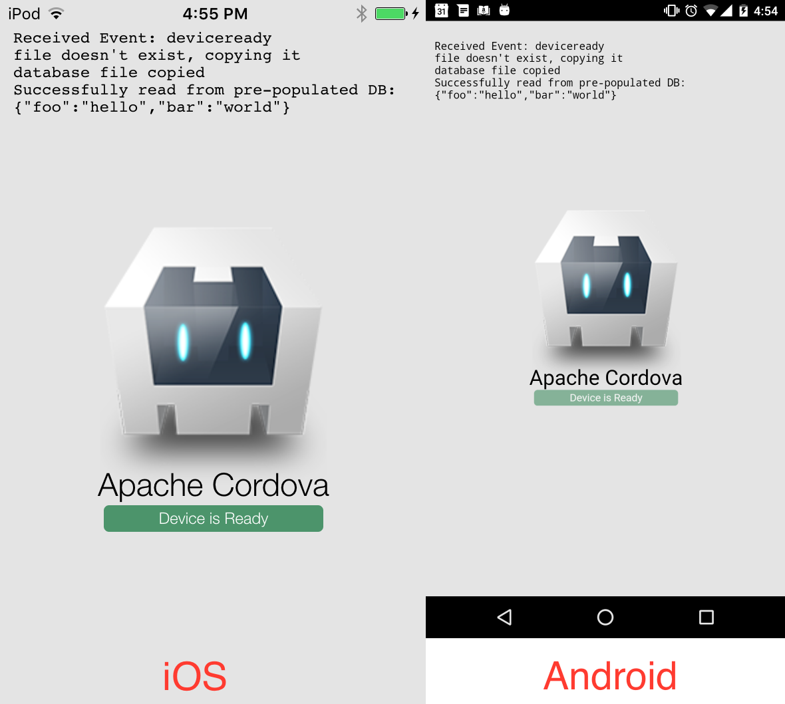

Cordova prepopulated database demo
=====

Small app to demonstrate how to use prepopulated databases with
[Cordova SQLite Plugin 2](https://travis-ci.org/nolanlawson/cordova-plugin-sqlite-2).

Running this app
---

Run these commands:

    git clone https://github.com/nolanlawson/cordova-prepopulated-database-demo.git
    cd cordova-prepopulated-database-demo
    cordova plugin add cordova-plugin-file
    cordova plugin add cordova-plugin-sqlite-2

Then to run on iOS:

    cordova platform add ios
    cordova run ios

Or to run on Android:

    cordova platform add android
    cordova run android

What you'll see:



How it works
---

Note the `mydatabase.db` file in `www/`. This is a simple database, with the following
structure:

    > .schema
    CREATE TABLE mytable (foo text, bar text);
    > SELECT * FROM mytable;
    hello|world

(You can do `sqlite3 www/mydatabase.db` on the command line to see this for yourself.)

When the app starts up, it uses the `cordova.file` API to check if the file
has already been copied. If not, it copies it from the read-only application directory
(`file:///android_asset/` on Android, `/var/mobile/Applications/<UUID>/`
on iOS) to the data directory (`files/` on Android, `Library/NoCloud` on iOS), where it becomes
read-write. For more details, see the [Cordova file plugin](https://github.com/apache/cordova-plugin-file).

Do it yourself
----

If you want a simple copy-paste job, you can borrow my own code from this project.
Note that you will need a `Promise` polyfill if you are targeting older versions of
Android or iOS:

```js
function copyDatabaseFile(dbName) {
  var sourceFileName = cordova.file.applicationDirectory + 'www/' + dbName;
  var targetDirName = cordova.file.dataDirectory;
  return Promise.all([
    new Promise(function (resolve, reject) {
      resolveLocalFileSystemURL(sourceFileName, resolve, reject);
    }),
    new Promise(function (resolve, reject) {
      resolveLocalFileSystemURL(targetDirName, resolve, reject);
    })
  ]).then(function (files) {
    var sourceFile = files[0];
    var targetDir = files[1];
    return new Promise(function (resolve, reject) {
      targetDir.getFile(dbName, {}, resolve, reject);
    }).then(function () {
      console.log("file already copied");
    }).catch(function () {
      console.log("file doesn't exist, copying it");
      return new Promise(function (resolve, reject) {
        sourceFile.copyTo(targetDir, dbName, resolve, reject);
      }).then(function () {
        console.log("database file copied");
      });
    });
  });
}
```

Then:

```js
copyDatabaseFile('mydatabase.db').then(function () {
  // success! :)
}).catch(function (err) {
  // error! :(
  console.log(err);
});
```